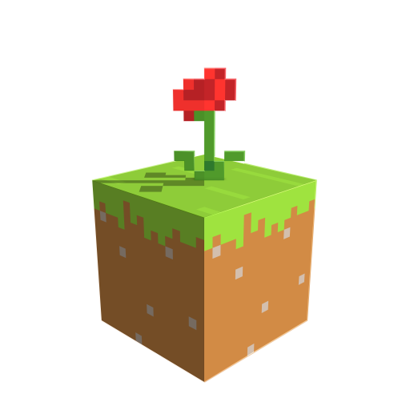

<h1>
  
  Lightflow for Blockbench
</h1>

> **Light, shape, atmosphere, and final renders — without leaving Blockbench.**

[](#project-status)
[](#requirements)
[](#installation)
[](https://ko-fi.com/midford327)


Lightflow is the rendering toolkit I always wanted inside Blockbench.

I built it for artists who want to take a model from a normal viewport to a deliberate final image: place real lights, shape shadows, build materials, create a Minecraft-inspired sky, add fog and light shafts, compose the shot, and export a high-resolution render — all in the same editor where the model was created.

Lightflow is already usable as my **first stable development version**, but it is **not finished, not a final public release, and not yet available in the Blockbench Plugin Marketplace**. Interfaces, presets, compatibility details, and project data may still change while I prepare the first public release.

## What Lightflow brings to Blockbench

| Module | What it does |
| --- | --- |
| **Light Manager** | Point, spot, and directional lights; viewport gizmos; animation; adaptive shadows; final-render shadow quality. |
| **Lightflow Environment** | Minecraft-style time, sky, stars, sun, moon, clouds, ambient response, reflections, and environment shadows. |
| **Shader Architect** | Artist-facing materials, PBR and stylized presets, material instances, per-element/per-face overrides, editable GLSL, AO, SSR, SSS, rim light, outlines, and pixelated shadows. |
| **Lightflow Atmosphere** | Local fog, height fog, volumetric clouds, cinematic dust, and occluded light shafts. |
| **Studio Render** | Realtime Scene Composer, Bloom, color grading, camera presets, framing, transparent output, tiled supersampling, and high-resolution still exports. |

Together, the five modules form one workflow:

```text
MODEL → LIGHT → ENVIRONMENT → MATERIAL → ATMOSPHERE → COMPOSE → RENDER
```

## Why I am building it

Blockbench is one of the fastest and most approachable tools for creating stylized and Minecraft-oriented assets. But presenting those assets often means leaving the editor, rebuilding the scene elsewhere, or accepting a basic viewport screenshot.

Lightflow is my attempt to close that gap without turning Blockbench into something it is not. The goal is not to imitate an offline ray tracer with fake labels. The goal is a fast, readable, artist-controlled renderer that respects Blockbench projects and makes polished visual presentation accessible to beginners while retaining deep controls for technical artists.

## Project status

**Current milestone: stable development preview / pre-release.**

- The complete five-module workflow is functional and can produce polished still images.
- This is the first version I consider stable enough for real artist testing.
- It is still under active development and should not be treated as feature-complete.
- Lightflow is not yet published in the official Blockbench Plugin Marketplace.
- Installation is currently manual.
- Some UI, defaults, presets, persistence formats, and compatibility behavior may change before the first public release.
- Back up important `.bbmodel` files before testing new builds.

The repository is currently being prepared for a wider public release. Feedback from real projects is especially valuable during this phase.

## Requirements

- **Blockbench 4.9.0 or newer**.
- **Blockbench Desktop is strongly recommended.**
- A WebGL-capable GPU; a dedicated GPU is recommended for Atmosphere, realtime Bloom, high-resolution shadows, and 4K/8K exports.
- If your computer has both integrated and dedicated graphics, configure your operating system to run Blockbench with the **high-performance / dedicated GPU**. This can make viewport previews, realtime effects, and final renders significantly faster.
- All Lightflow modules should come from the same build.
- Use `.bbmodel` for working files that need Lightflow project data to persist.

## Installation

Lightflow is **not in the Plugin Marketplace yet**. You can install it directly from its raw GitHub URLs or from downloaded files.

### Install from URL

In Blockbench, open **File → Plugins → Load Plugin from URL**, then paste and install each URL **one at a time in this order**. Each field below can be copied independently:

1. **Light Manager**

```text
https://raw.githubusercontent.com/MidFord/lightflow-blockbench/refs/heads/main/light_manager.js
```

2. **Shader Architect**

```text
https://raw.githubusercontent.com/MidFord/lightflow-blockbench/refs/heads/main/shader_architect.js
```

3. **Studio Render**

```text
https://raw.githubusercontent.com/MidFord/lightflow-blockbench/refs/heads/main/studio_render.js
```

4. **Lightflow Atmosphere**

```text
https://raw.githubusercontent.com/MidFord/lightflow-blockbench/refs/heads/main/lightflow_atmosphere.js
```

5. **Lightflow Environment**

```text
https://raw.githubusercontent.com/MidFord/lightflow-blockbench/refs/heads/main/lightflow_environment.js
```

Restart Blockbench or reload the plugins after installing or updating them.

> **Important:** Light Manager is the foundation module and must be installed first.
>
> **Current maturity:** Light Manager, Shader Architect, and Studio Render are currently the most complete and polished modules. Lightflow Atmosphere and Lightflow Environment are functional, but remain in a more active beta stage and may change more frequently.

### Install from downloaded files

You can also download or clone the repository and use **File → Plugins → Load Plugin from File**. Load the same five JavaScript files in the order shown above.

### Dedicated GPU recommendation

Use **Blockbench Desktop** whenever possible. If your system has a dedicated GPU, configure your operating system or GPU control panel so Blockbench uses the **high-performance GPU** instead of integrated graphics. This improves realtime preview performance and can reduce final render times.

For update instructions, common installation problems, and development builds, see **[Installation Guide](docs/INSTALLATION.md)**.

## Your first Lightflow render

1. Open a model and switch to **Lightflow Render** mode.
2. Add a directional light with **Light Manager** and aim it at the model.
3. Open **Environment Composer** and choose a sky preset or time of day.
4. Open **Material Studio**, choose a Lightflow material, and apply it globally.
5. Add a **Volume Domain** only when the shot benefits from mist, clouds, dust, or light shafts.
6. Open **Scene Composer** and adjust Bloom and color grading.
7. Open **Studio Render**, choose a resolution and samples, then render to preview or save.

The full guided walkthrough is in **[Your First Render](docs/FIRST_RENDER.md)**.

## A renderer designed around artists

Lightflow exposes complex rendering systems through controls that describe the visual result rather than the implementation whenever possible:

- place and aim lights directly in the viewport;
- use separate preview and final shadow quality;
- start from materials and lighting profiles instead of writing shaders;
- override one object or one cube face without rebuilding the entire material;
- fit lights, shadow bounds, atmospheres, and render framing to selected content;
- keep expensive effects at interactive preview quality, then raise them for Studio Render;
- preserve transparent pixels, emissive textures, additive textures, layered textures, Meshes, Texture Meshes, and zero-thickness cubes.

Advanced users can still edit GLSL, import/export `.samat` materials, inspect performance counters, and build reusable material instances.

## Documentation

- **[Installation Guide](docs/INSTALLATION.md)** — install, update, remove, and verify the suite.
- **[Your First Render](docs/FIRST_RENDER.md)** — a practical beginner tutorial from model to final image.
- **[Module Guide](docs/MODULES.md)** — where every tool lives and when to use it.
- **[Workflows](docs/WORKFLOWS.md)** — product renders, cinematic Minecraft scenes, transparent exports, and performance-first iteration.
- **[Performance & Troubleshooting](docs/TROUBLESHOOTING.md)** — common problems, quality costs, and safe starting settings.
- **[Development Status](docs/DEVELOPMENT_STATUS.md)** — what is stable today, what is still changing, and what is planned.

## Compatibility and honest boundaries

Lightflow currently runs through Blockbench's Three.js/WebGL rendering environment. It uses optimized raster lighting, shadow maps, screen-space effects, volumetric composition, and supersampled still rendering.

It does **not** currently provide hardware ray tracing, path tracing, or a cosmetic “RTX” switch. Colored transmissive shadows are also not part of the current stable path. I would rather document a real limitation than advertise a feature the host renderer cannot genuinely provide.

Lightflow is not a replacement for Blender, a game engine, or an offline renderer. It is a focused presentation and rendering workflow built specifically for Blockbench artists.

## Development and validation

The repository includes syntax and regression validation for the independently loadable modules:

```bash
npm install
npm run validate
```

The validation harness requires Node.js 18 or newer. Automated checks do not replace manual testing inside Blockbench with a real GPU.

## Feedback and bug reports

When reporting a problem, include:

- your Blockbench version and operating system;
- GPU model and display scaling;
- the Lightflow module versions;
- a minimal `.bbmodel` or reproducible scene when possible;
- exact steps to reproduce;
- screenshots or a short recording;
- browser console errors from **View → Developer Tools**.

Please separate reproducible bugs from visual suggestions. Both are useful, but they require different investigation.

## Roadmap

Before the first public Marketplace release, my priorities are:

- final UI and UX consistency across all modules;
- broader real-project compatibility testing;
- safer migrations between development builds;
- clearer presets and beginner onboarding;
- more examples and visual documentation;
- additional performance work for large scenes and integrated viewport effects;
- packaging, metadata, and review preparation for the Blockbench Plugin Marketplace.

Longer-term experiments may include deeper animation workflows, expanded atmosphere tools, optional alternate rendering backends, and new material systems — only when they can be implemented honestly and reliably.

## Support Lightflow

Lightflow is an independent project built and maintained by MidFord.

If Lightflow improves your Blockbench workflow and you would like to help support continued development, testing, documentation, and future releases, you can support the project on Ko-fi:

[](https://ko-fi.com/midford327)

Support is completely optional and does not affect access to Lightflow or its features.

## License and trademarks

The project does not currently include a repository license file. Until a license is added, normal copyright restrictions apply; public source visibility alone does not grant permission to redistribute or reuse the code.

Blockbench is a separate project and trademark. Minecraft is a trademark of Microsoft. Lightflow is an independent project and is not affiliated with, endorsed by, or sponsored by Blockbench, Mojang Studios, or Microsoft.

---

<p align="center"><strong>Built by MidFord for artists who want their Blockbench work to feel finished.</strong></p>
